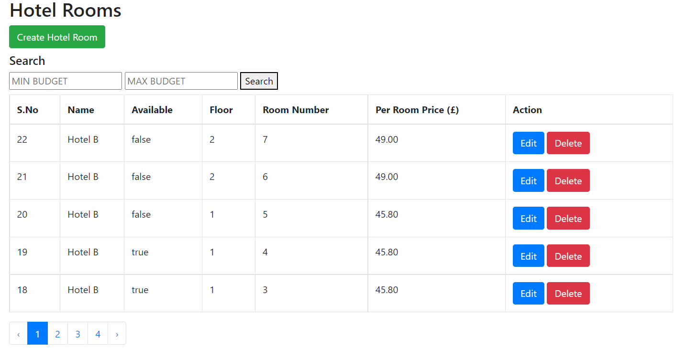
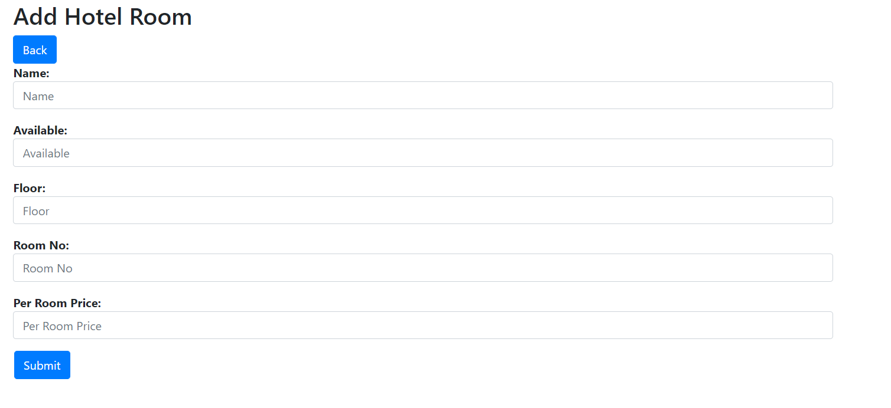
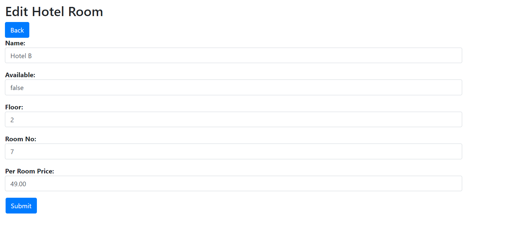
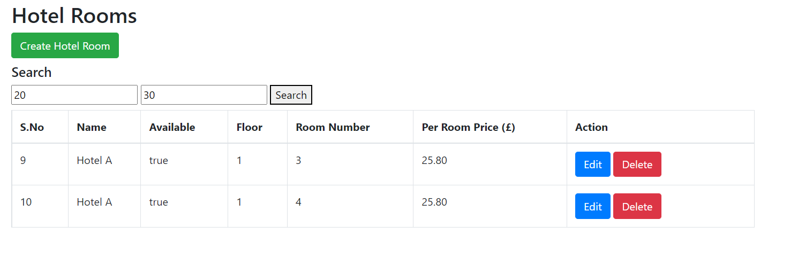

## Title and Description

MercuryHolidays

A simple GUI was created for easy CRUD and search process based on the requirement instead of completely interacting with the codebase.


About Laravel

Laravel is a web application framework with expressive, elegant syntax. We believe development must be an enjoyable and creative experience to be truly fulfilling. Laravel takes the pain out of development by easing common tasks used in many web projects, such as:
## How to Install

Clone the Git Repository

```bash
$ git clone https://github.com/gbengs50/MercuryHolidays.git
```
## Updating Dependencies

UPDATING DEPENDENCIES

Update Dependencies / Required Libraries by navigating to the root of the application via command line and running below code

```bash
$ composer Update
```
## Configure Database
Simply copy contents of the .env.example file and save as a new file named .env then proceed by updating your database credentials.

```bash
DB_CONNECTION=mysql

DB_HOST=127.0.0.1

DB_PORT=3306

DB_DATABASE=mecuryholiday

DB_USERNAME=your_username

DB_PASSWORD=your_password
```
## Migrate Tables
Run the artisan migration code by using the below command

```bash
$ php artisan migrate
```
## Run Application
Run the MercuryHolidays application by running below command

```bash
$ php artisan serve
```

Visit Below URL to view application

```bash
http://localhost:8000/hotel
```


## Screenshots

Hotel Room List


Create New Room


Edit Hotel Room


### Search By Budget

Given a criteria of:

- Minimum budget £20 per room.
- Maximum budget £30 per room.
- Number of rooms required is 2.




## Authors

- [@gbengs50](https://www.github.com/gbengs50)


## 🚀 About Me
I’m an experienced software developer with over 9 years’ experience in JAVA, PHP, KOTLIN, artificial intelligence programming, database management & development, android application programming, project management, information system support and security as well as a product manager who has managed products from discovery to development and successful launch of the product into African markets & beyond. I lead a team of product managers, designers & developers in building customer-centric products that are in use in the financial and educational technology industry.

I have a proven track record in software development, managing development of products, quality assurance testing and determining the most viable product (MVP) to ensure effectiveness and quick launch to the market.

I love managing teams and solving customer problems. I coach and teach developers and apply my skills as a product manager towards making a bigger impact in product delivery in organizations. 
I am ready & prepared to take up more challenging assignments that solve global challenges.


## Appendix

Any additional information goes here

